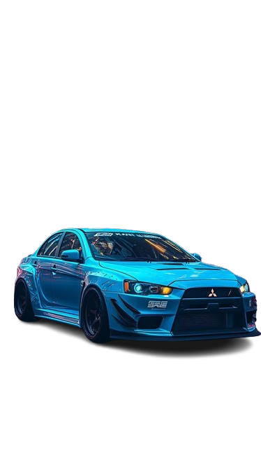

<div align="center">



# Lancer Evolution X — Landing Page

Landing page responsiva inspirada no visual Mercedes-Benz fornecido como referência, agora reimaginada para o Mitsubishi Lancer Evolution X com assinatura da marca **TizGon**.

</div>

## 🚗 Sobre o projeto

- Interface inspirada em showroom premium com navegação em pílulas e janela “glassmorphism”.
- Seção hero com destaques interativos (callouts) para os diferenciais do Evo X.
- Galeria “Garage TizGon” com três variações do carro em alta resolução.
- Cards de especificações, seletor de cores e CTA estilizados seguindo a estética original.
- Totalmente responsivo: ajustes específicos para 1024 px, 720 px, 540 px e 420 px.

## 🛠️ Tech stack

- **HTML5** sem frameworks para estruturação.
- **CSS3** com variáveis, gradientes, animações (float/pulse) e media queries.
- Google Fonts (`Poppins`, `Playfair Display`) para tipografia premium.

## 📂 Estrutura

```
.
├── index.html          # Estrutura da landing page
├── styles.css          # Estilos completos e responsividade
├── Mitsubishi_Lancer_EvoX_Resumo.txt  # Conteúdo base utilizado
└── /assets (PNG)       # Imagens em background transparente
```

## 🧭 Principais sessões

1. **Header & Navigation** – Menu em cápsulas com logo TizGon estilizado.
2. **Hero Panel** – Carro em destaque com callouts animados e card de potência.
3. **Garage TizGon** – Galeria com três estilos (Urban Assault, Neon Dream, Track Weapon).
4. **Feature Highlights** – Cards com especificações resumidas.
5. **Color Strip** – Paleta de cores sugeridas para customização.

## 🚀 Como rodar localmente

```bash
git clone https://github.com/<seu-usuario>/<seu-repo>.git
cd <seu-repo>
# abra index.html no navegador
```

> Em Windows, pode usar `start index.html`; no macOS `open index.html`; no Linux `xdg-open index.html`.

## ✅ Próximos passos sugeridos

- Implementar troca dinâmica de imagem conforme seleção de cor.
- Adicionar formulário funcional (integração com backend ou serviço de e-mail).
- Incluir um manifesto da marca TizGon ou carrossel de depoimentos.

---

Feito com ❤️ e muita octanagem JDM por **TizGon**.

